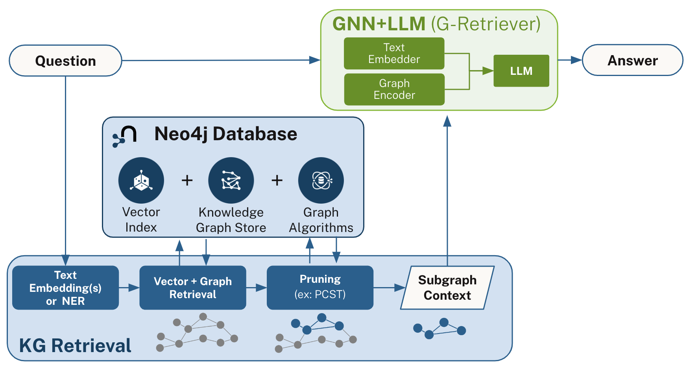

# Neo4j GraphRAG with GNN+LLM

__Knowledge graph retrieval to improve multi-hop Q&A performance, optimized with GNN + LLM models.__

This repo contains experiments for combining Knowledge Graph Retrieval with GNN+LLM models to improve RAG.  Currently leveraging [Neo4j](https://neo4j.com/generativeai/), [G-Retriever](https://arxiv.org/abs/2402.07630), and the [STaRK-Prime dataset](https://stark.stanford.edu/dataset_prime.html) for benchmarking. 

## Architecture Overview

- RAG on large knowledge graphs that require multi-hop retrieval and reasoning, beyond node classification and link prediction.
- General, extensible 2-part architecture: KG Retrieval & GNN+LLM.
- Efficient, stable inference time and output for real-world use cases.

## Installation
### The database & dataset
Install the Neo4j database (and relevant JDK) by following [official instructions](https://neo4j.com/docs/operations-manual/current/installation/linux/debian/#debian-installation).
You'll also need the Neo4j [GenAI plugin](https://neo4j.com/docs/cypher-manual/current/genai-integrations/#_installation).

With the database installed and running, you can load the STaRK-Prime dataset by running the python notebook in `data-loading/stark_prime_neo4j_loading.ipynb`.
Alternatively, obtain a database dump at [AWS S3](`s3://gds-public-dataset/stark-prime-neo4j523`) for database version 5.23.

### Other requirements
Install all required libraries in `requirements.txt`.
Additionally, make sure huggingface-cli authentications are set up for using relevant (Llama2, Llama3) models.

## Reproduce results
1. To train a model with default configurations, run the following command:
`python train.py --checkpointing --llama_version llama3.1-8b --retrieval_config_version 0 --algo_config_version 0 --g_retriever_config_version 0 --eval_batch_size 4`
2. To get result for Pipline, run `eval_pcst_ordering.ipynb` on using the intermediate dataset and g-retriever model.
3. To exactly reproduce results in the below table, use the `stanford-workshop-2024` branch. 
The `main` branch contains new incremental changes and improvements.
   

## Additional Neo4j GraphRAG Resources
- For a high-level overview of Neo4j & GenAI, have a look at [neo4j.com/genai](http://neo4j.com/genai).
- To learn how to get started using LLMs with Neo4j see [this online Graph Academy course](https://graphacademy.neo4j.com/courses/llm-fundamentals/) which is one of many [Neo4j-GenAI courses](https://graphacademy.neo4j.com/categories/llms/) covering multiple topics ranging from KG construction, to graph+vector search, and building GenAI chatbot applications.
- Pick your [GenAI framework of choice](https://neo4j.com/developer/genai-ecosystem/genai-frameworks/) to start building your own GenAI applications with Neo4j.
- Check out [Neo4j GenAI technical blogs](https://neo4j.com/developer-blog/tagged/genai/) for other worked examples and integrations.

